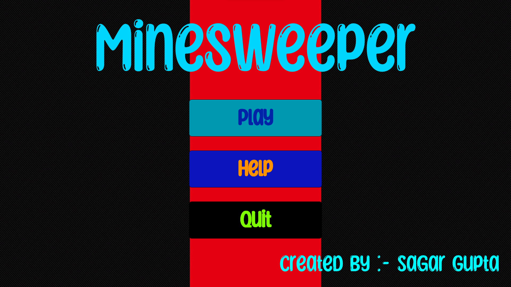
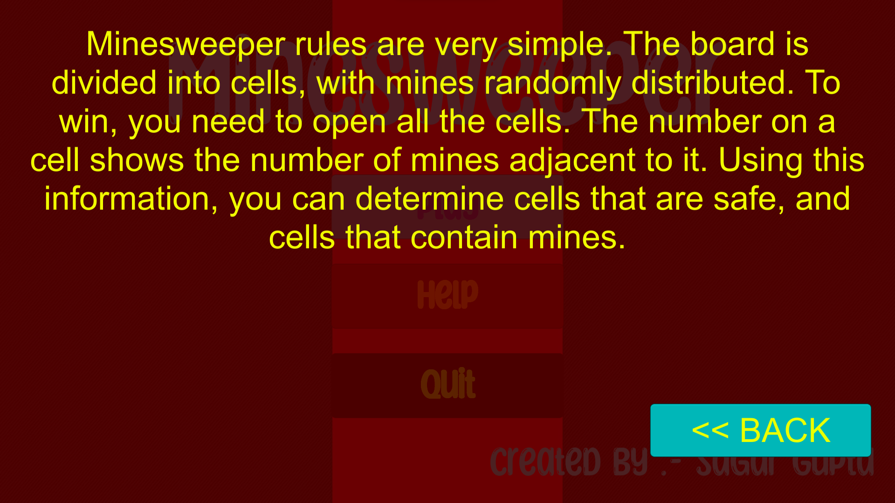
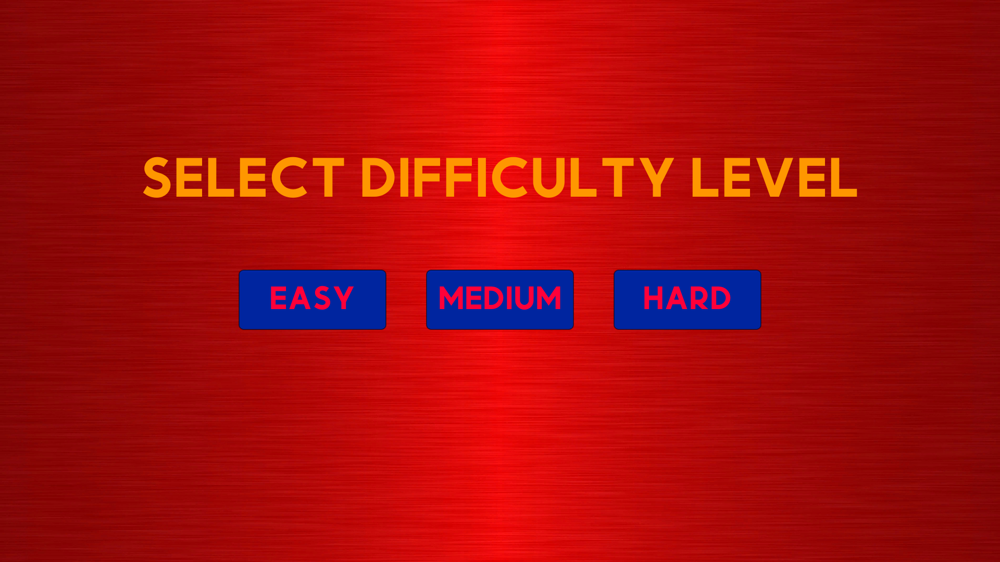
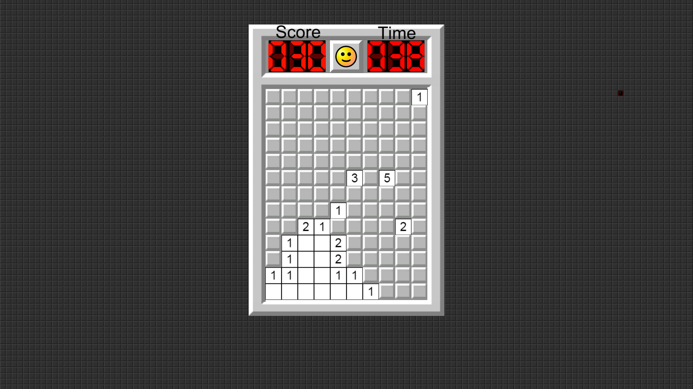
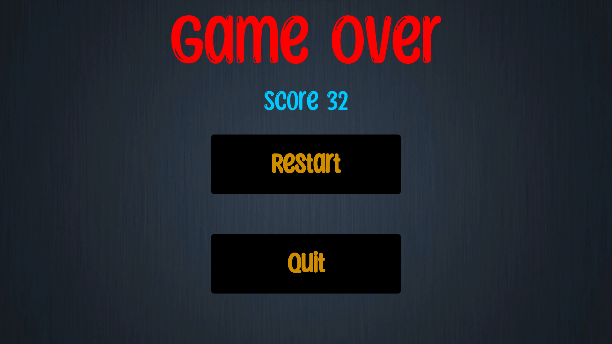

<h1 align="Center"> Minesweeper Game </h1>

<h5 align="center"> Project Assignment 2 - Computer Game Development and Animation ,<a href="https://nitw.ac.in/"> NITW</a> (Winter 2021) </h5>

<!-- ABOUT THE PROJECT -->
<h2 id="about-the-project"> :pencil: About The Project</h2>

 
  For those of you not familiar with Minesweeper game, In Minesweeper, mines are scattered throughout a board, which is divided into cells. Cells have two states: unopened and opened. An unopened cell is blank and clickable, while an opened cell is exposed. this Contains 3 difficulty levels easy , medium and hard the number of mines are different in each level . You have to logically open all non mines bloack to win the game.If a player opens a mined cell, the game ends, as there is only one life per game. Otherwise, the opened cell displays either a number, indicating the number of mines diagonally and/or adjacent to it, or a blank tile (or "0"), and all adjacent non-mined cells will automatically be opened .

<!-- OVERVIEW -->
<h2 id="overview"> :cloud: Overview</h2>

 
  In this project, A game of Minesweeper begins when the player makes the first click on a board with all cells unopened. This click is guaranteed to be safe with some variants further guaranteeing that all adjacent cells are safe as well. During the game, the player uses information given from the opened cells to deduce further cells that are safe to open, iteratively gaining more information to solve the board. I have used minesweeper algo to implement such logic of game.

<!-- PROJECT FILES DESCRIPTION -->
<h2 id="Language-and-tools"> 💻 Language and Tools Used</h2>

<ul>
  <li><b>C#</b> - For Coding Part and Libraries.</li>
  <li><b>Visual Studio Code</b> - Text Editor For Running C# Codes.</li>
  <li><b>Unity Engine</b> - For Handling Scripts with Runnable Environment.</li>
</ul>

<!-- PROJECT FILES DESCRIPTION -->
<h2 id="project-files-description"> :floppy_disk: Project Files Description</h2>

<ul>
  <li><b>Scripts/Element.cs</b> - Here all element like mines and number random generation algo and when game to declare won and lose resides.</li>
  <li><b>Scripts/MainMenuScript.cs</b> - Where all Main Menu UI design button allignment all resides.</li>
  <li><b>Scripts/ScoreScript.cs</b> - This Maintains the Score Increment With Every non mine bloack is opened.</li>
  <li><b>Scripts/DifficultyScript.cs.cs</b> - This Maintains all 3 difficulty level which change in number of mines and also reduces completion time.</li>
  <li><b>Scripts/PlayField.cs</b> - This Script Contain all detail about playing board like border and other Ui design that we see while playing.</li>
  <li><b>Scripts/TimeScript.cs</b> - This Keep Track of reverse timing of game onece time reach to 0 seconds it declare game over.</li>
  <li><b>Scripts/GameOverScript.cs</b> - This Contain GameOver Screen UI design and Score bar.</li>
</ul>

 
 <h2 id="project-files-description"> ⏯️ How to Run Game</h2>
 <ul>
  <li><b>STEP-1 </b> - To Download Source Code and Playable Build click [Download](https://drive.google.com/drive/folders/1JlmUXbs6b4c6xjjjK9gznCmOtLS-5NJ_?usp=sharing).</li>
  <li><b>STEP-2 </b> - Extract the **MinsweeperBuild.zip** for Playable Content and **MinesweeperSource.zip** to see Source Code Content.</li>
  <li><b>STEP-3 </b> - Open Extracted Folder Than double Click on **MinsweeperBuild.exe** to play game.</li>
  <li><b>STEP-4 </b> - Enjoy the Game!.</li>
</ul>

