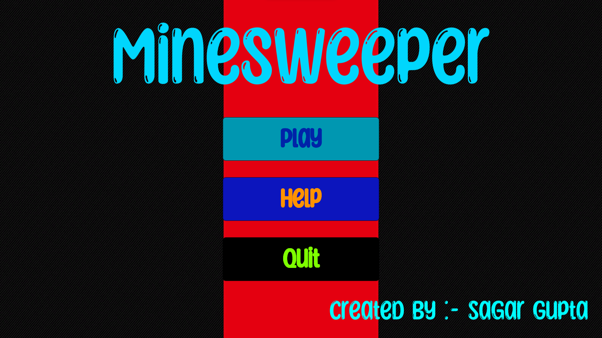
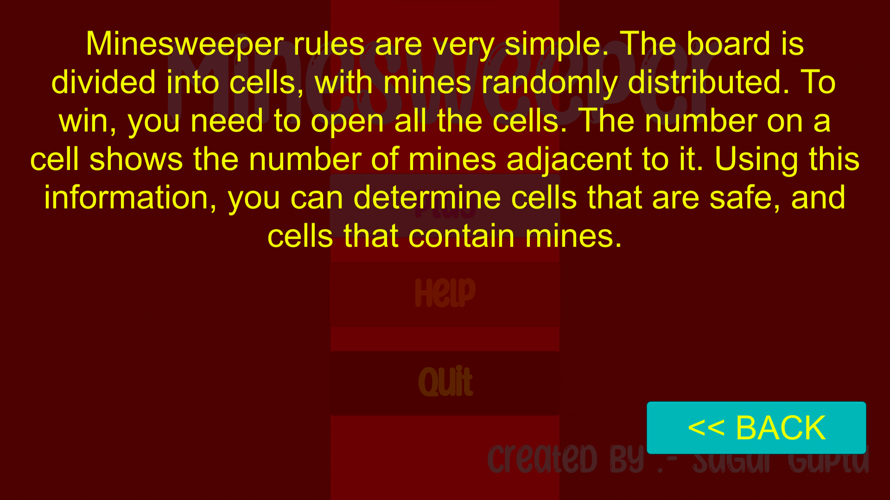
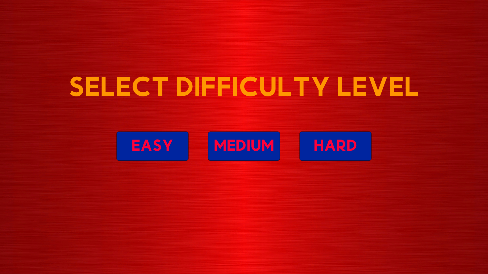
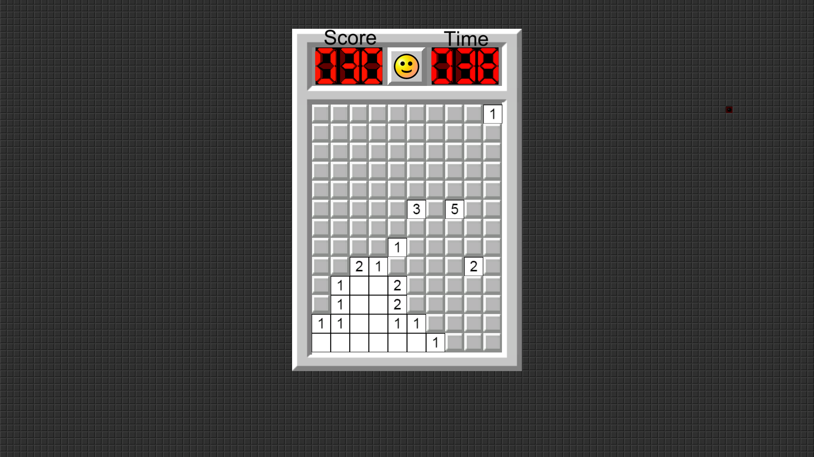
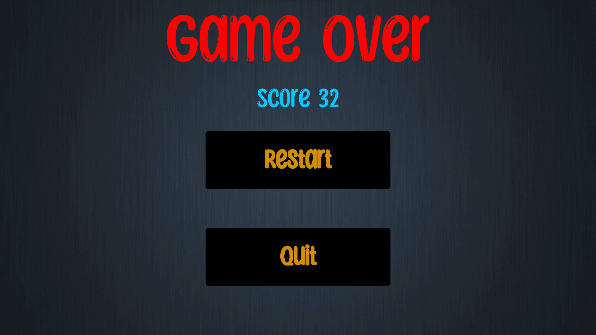

<h1 align="Center"> Minesweeper Game </h1>

<h5 align="center"> Project Assignment 2 - Computer Game Development and Animation,<a href="https://nitw.ac.in/"> NITW</a> (Winter 2021) </h5>

> Note: This is a sample/reference project — only the game scripts and screenshots are published here, not the full Unity project. A playable Windows build is available on the [releases page](https://github.com/Sagargupta16/Minesweeper-Game__UnityEngine/releases/latest).

<!-- ABOUT THE PROJECT -->
<h2 id="about-the-project"> :pencil: About The Project</h2>

 
  For those of you not familiar with Minesweeper: mines are scattered throughout a board, which is divided into cells. Cells have two states: unopened and opened. An unopened cell is blank and clickable, while an opened cell is exposed. This game contains 3 difficulty levels — easy, medium and hard — with a different number of mines in each level. You have to logically open all non-mine cells to win the game. If a player opens a mined cell, the game ends, as there is only one life per game. Otherwise, the opened cell displays either a number, indicating the number of mines diagonally and/or adjacent to it, or a blank tile (or "0"), and all adjacent non-mined cells will automatically be opened.

<!-- OVERVIEW -->
<h2 id="overview"> :cloud: Overview</h2>

 
  In this project, A game of Minesweeper begins when the player makes the first click on a board with all cells unopened. This click is guaranteed to be safe with some variants further guaranteeing that all adjacent cells are safe as well. During the game, the player uses information given from the opened cells to deduce further cells that are safe to open, iteratively gaining more information to solve the board. I have used the standard Minesweeper algorithm to implement this game logic.

<!-- LANGUAGE AND TOOLS -->
<h2 id="language-and-tools"> 💻 Language and Tools Used</h2>

<ul>
  <li><b>C#</b> - For Coding Part and Libraries.</li>
  <li><b>Visual Studio Code</b> - Text Editor For Running C# Codes.</li>
  <li><b>Unity Engine</b> - For Handling Scripts with Runnable Environment.</li>
</ul>

<!-- PROJECT FILES DESCRIPTION -->
<h2 id="project-files-description"> :floppy_disk: Project Files Description</h2>

<ul>
  <li><b>Scripts/Element.cs</b> - Handles the random generation of mines and numbers, and decides when the game is won or lost.</li>
  <li><b>Scripts/MainMenuScript.cs</b> - Contains the Main Menu UI design and button alignment.</li>
  <li><b>Scripts/ScoreScript.cs</b> - Maintains the score, incrementing it every time a non-mine cell is opened.</li>
  <li><b>Scripts/DifficultyScript.cs</b> - Maintains all 3 difficulty levels, changing the number of mines and reducing the completion time.</li>
  <li><b>Scripts/PlayField.cs</b> - Contains all details about the playing board, like the border and other UI elements seen while playing.</li>
  <li><b>Scripts/TimerScript.cs</b> - Keeps track of the countdown timer; once time reaches 0 seconds it declares game over.</li>
  <li><b>Scripts/GameOverScript.cs</b> - Contains the Game Over screen UI design and score bar.</li>
</ul>

 
 <h2 id="how-to-run-game"> ⏯️ How to Run the Game</h2>
 <ul>
  <li><b>STEP-1 </b> - To download the source code and playable build, click <a href="https://github.com/Sagargupta16/Minesweeper-Game__UnityEngine/releases/latest">Download</a>.</li>
  <li><b>STEP-2 </b> - Extract <b>MinesweeperBuild.zip</b> for the playable game and <b>Source code (zip)</b> for the source code.</li>
  <li><b>STEP-3 </b> - Open the extracted folder, then double-click <b>Minesweeper.exe</b> to play.</li>
  <li><b>STEP-4 </b> - Enjoy the game!</li>
</ul>

